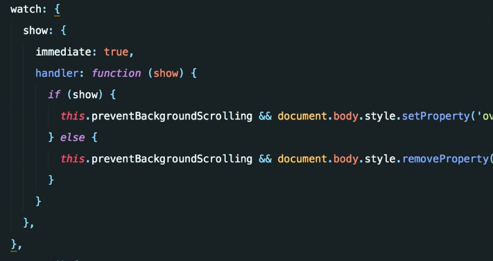

1. Controlled Components:
 - Does not have any of its own state
 - Value of child is controlled by the parent (passed via v-model)
 - Communicates new state through events

2. Customizing VModel
 - VModel is sugar for `:value="x" @input="handleInput"`
 - You can customize controlled components to emit names that are more clear for what they are doing
 - Example below, emits `toggle` and value of `toggled` but is able to communicate with vmodel using regular input/value


3. Wrap Component Libraries
 - Treat these as a controlled component
 - duh: use refs for selectors `input ref="name"` then `this.$refs.name`

4. Encapsulating Global Behavior: Modal close on Escape Button
 - Keep the global behavior as close the component as you can.  It is the concern of the component, not the app to close when escape is pressed.
 - Two options, either use the destroyed hook to removeEventListener, or use the better way of listening  in the created for setting up the listener
 - I think this is much better because it is in a single place, this could be included as a mixin or provided from the parent.


5. Encapsulating Global Behavior: Modal Scrolling on Body
 - no scrolling requires `overflow: hidden` on parent of the modal.
 - can accomplish on App and global isModalShown, couples
 - better, is to have the component be responsible for handling the global styling



6. Encapsulating Global Rendering Behavior: Portals
 - We need a delete account button to display a modal in a different part of our dom tree
 - Portals give us a way to target some part of our dom anywhere in our app
 - so the when is decoupled from the how

7. Reusing multiple Portals
 - Portal targets can only hold the content for item at a time.  If you reference 2 times it will fail
 - Don't do multiple portal targets, it does not scale well.
 - To handle multiple, use v-if on the portal target
 - Always conditionally render the portal target, 1 target for various things that are Singleton (modals, tooltips, etc)

8.9
 - Vue merges class attributes passed down to a component with those on the parent element

10-11
 - Slots are a great way to compose
 - Think of regular slots a regular props
 - This of scoped slots as passing functions

### [Psuedoslot (function) vs slot](https://codesandbox.io/s/72vq6w35w1)
```
<template>
  <div>
    <div v-for="contact in contacts">
      {{ psuedoSlotFxn({ contact }) }}
    </div>
  </div>
</template>

<script>
export default {
  name: "Card",
  props: ['psudoSlotFxn'],
  data() {
    return {
      contacts: [
        { first: "jim", last: "jones" },
        { first: "jane", last: "jones" },
      ]
    }
  },
}
</script>

// Used
<templates>
  <cards :psudoSlotFxn="({ contact }) => contact.first" />
</template>
```

### With Slots
```
<template>
  <div>
    <div v-for="contact in contacts">
      <slot :contact="contact" name="contact"/>
    </div>
  </div>
</template>

<script>
export default {
  name: "Card",
  data() {
    return {
      contacts: [
        { first: "jim", last: "jones" },
        { first: "jane", last: "jones" },
      ]
    }
  },
}
</script>

// Used
<templates>
  <cards>
    <template slot="contact" slot-scope="{ first }">
      {{ first }}
    </template>
  </cards>
</template>
```

16
 - Data provider components act as containers and accept a slot
 - They request the data and pass it to their slots
 - Think Contacts.json request and Contacts Components, break apart data
 
17-21
 - Slot scopes access one of 3 prop types
   - data (data.json data provider) some things that are needed to act on (render)
   - action (functions that do things) want to define behavior but don't know how consumer will use it 
   - binding props - some things that the
     - for instance, instaed of passing scoped props for onInput, inputValue, handleBackspace and addTag
     - instead pass a params that encapsulate the details and let the component add them where they would like
       - inputValue becomes `inputProps` and it parent would v-bind="inputProps"
       - eventListenrs of backspace, addtag, onInput become `inputEvents` and would v-on="inputEvents"
     - if binding props ever need context (tag instead of mouse/key events) curry/partialApplication the `inputEvents` so that it returns a function

22 - Using the renderless component above to create new list/button functionality

25 - Use Data provider to encapsulate watching for the width/height of component and reacting to the width changing     

26 Provide/Inject 
  - Really nice provide/inject example.  Provide a reactive object in order to send down.
  - When doing this keep in mind that you can have naming collisions, so namespace them
 
```
export default {
  provide() { 
    return {
      sharedState: this.sharedState,
    };  
  },
  data() {
    return {
      sharedState: {
        this.activeItem: 1,
      }
    }
  }
};
```

27 - Really great example of drag and droppable component

30 @2:01 - Great example of focusing searchinput on selection

32 - Refs are not guaranteed to be ordered when they are placed on a v-for
  - instead grab children of the wrapping v-for
  - scrollIntoView({ block: 'nearest' }) gives really nice native feel for scrolling
  
34 - Setup non-reactive data attributes in order to prevent memory leaks (popper js example, new Popper every open vs reference)
