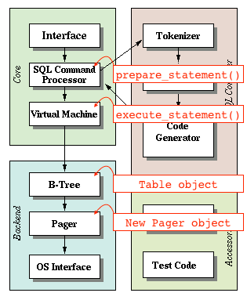

### [Les Build a Simple Database](https://cstack.github.io/db_tutorial)

Any query on the database goes through several steps

|DB General Parts|SQLite|
|---|---|
|||

 - Front End - Compiler: Convert chars into vm bytecode
   - tokenizer
   - parser
   - code generator
 - Back End
   - Virtual Machine - Perform operations on the bytecode, giant switch statement
   - B-tree - Nodes, 1 page in length.  Retrieve or save to disk
   - pager - Read/Write pages of data at offsets in db file.  Caches recently accessed and determines when to write back to memory
   - os interface - Interface for pager to various OS
   
### Part 5

Once we have some items complete, our diagram maps to our c functions in the following way


With any of these persisted items you can open a hex editor with
```
vim mydb.db
:%!xxd
```   

[Exceptional B-Tree Structure explaination](https://cstack.github.io/db_tutorial/parts/part7.html)

Tree vs Array Performance

|---|Unsorted Array of rows|Sorted Array of rows|Tree of nodes|
|---|---|---|---|
|Pages contain|only data|only data|metadata, primary keys, and data|
|Rows per page|more|more|fewer|
|Insertion|O(1)|O(n)|O(log(n))|
|Deletion|O(n)|O(n)|O(log(n))|
|Lookup by id|O(n)|O(log(n))|O(log(n))|


https://cstack.github.io/db_tutorial/parts/part8.html