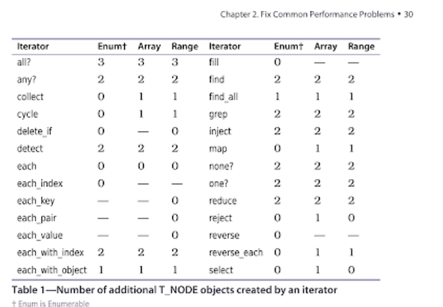

### Chapter 2 Common Performance Problems
See [Benchmark](./benchmark.rb) for a really great memory calculator for ruby
- Common slowness: extra malloc, data structure copying, Execution Context Copy, Memory Heavy Iterator, slow type conversions
- Optimize memory by avoiding allocations and memory leaks
- Write faster iterators that take less time/memory
- Use C when needed
 
#### Save Memory

##### Modify String in place
 - Use !bang methods to manipulate in place
 - gsub!, capitalize!, downcase!, upcase!, delete!, reverse!, slice!, etc
 - use when you can afford to
 
```
require 'benchmark'

str = "X" * 1024 * 1024 * 10
a = measure { new = str.gsub('X', 'Y') }
b = measure { str.gsub!('X', 'A') }

a + b 
```  

Use `String::<<` to concat strings.  It does it in a way that allocates less memory and does not trigger GC

```
a = "foo"
a += "bar"

a = "foo"
a << "bar"
```

##### Modify Array/Hash in Place
 - Similar to with strings, this can be a huge time savings
 
```
data = Array.new(100) { 'x' * 1024 * 1014 * 10 }

measure { data.map(&:upcase) }  
{"2.4.1":{"gc":"enabled","time":3.27,"gc_count":26,"memory":"832 MB"}}

measure { data.map!(&:upcase!) }  
{"2.4.1":{"gc":"enabled","time":3.42,"gc_count":26,"memory":"10 MB"}}
``` 

##### Read Files line by line
 - File.read: Pulls in entire file then manipulates
 - File.readlines: Pulls in line by line
 
CSV requires 13 times memory of file size.  Speed improvement will be between 20 and 35% faster

##### Anonymous Memory Leaks (Blocks/Procs)
```
module Logger
  extend self
  attr_accessor :output, :log_actions
  
  def log(&event)
    log_actions ||= []
    log_actions << event
  end
  
  def play
    output = []
    log_actions.each { |e| e.call(output) }
    puts output.join("\n")
  end
end
```

The above allows you to batch writing error messages to a log independent of when the message was recorded.

However, the `event` block is converted into a proc object and stored in the execution context.  So even an explicit `GC.start` will not clean it

All anonymous blocks are *not* dangerous
 - They do not store execution context unless converted to Proc object
 - When calling a func that stores anonymous block, ruby stores a ref to callers stack frame
 - Callee is guaranteed to exit befre callers stack is popped
 - When calling with `named` block, RUby assumes it makes sense to keep and clones execution context
 
Prefer anonymous blocks

```
# named block, converts to Proc
def take_block(&block)
  block.call(args)
end
take_block { |args| do_something(args) }

# anonymous, does not convert, does not copy execution context
def take_block
  yield(args)
end
take_block { |args| do_something(args) }


# example, where 
class LargeObject; end;
def do_something
  obj = LargeObject.new
  trap("TERM") { puts obj.inspect }
end

# C CODE UNDER THE HOOD causes block to proc
# http://ruby-doc.org/core-2.1.2/Signal.html#method-c-trap
cmd = rb_block_proc
``` 
<<<<<<< Updated upstream

##### Optimize Iterators
- Ruby will not GC the current object you are iterating before it is finished.  So large list in memory will stay even if you don't need it.
- Iterators are functions and can (will) create temp objects behind the scenes.  Adding work and hurting performance.
- Watch for iterator-unsafe ruby standard library functions (each_with_index creates an additional node variable which makes n additional objects)




```
class Thing; end
list = Array.new(100) { Thing.new }
def count
  puts ObjectSpace.each_object(Thing).count
end

count # 100
list.each { GC.start; count; #100 }
list = nil
GC.start
count # 0
```

##### Other unsafish areas
- Date.parse in old ruby versions
- Object#(class?|is_a?|kind_of?)
