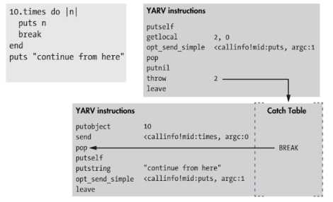

### Chapter 4 - Control Structures and Method Dispatch

YARV handles control with three primary instructions `branchunless`, `branchif` and `jump`

#### Jump/Branchunless


 - Ruby gets to 11 and evaluations opt_lt, this leaves either true or false on stack
 - branchunless (branch unless true) sees that
   - if stack is false, branches and goes to instruction 25
   - if stack is true, continues to 15, evaluates, ends up on 23 which jumps to 33
 
 
#### Leaving a Scope 

- Ruby is dynamic, you can break in any scope.  
- In the below code, ruby needs to be able to exit the loop and continue with the last ruby command in the parent scope.
- To handle YARV uses `throw`, which acts similarly to the Ruby throw keyword

 

To handle the throw YARV uses the concept of a `catch table` in each scope.  They contain a single pointer to where execution should continue after an exeception.  When ruby runs into the thow it
-Iteratres through all of the `rb_control_frame_t` in the stack
-if it finds a catch table pointer, it resets call stack (CFP pointer) and internal YARV to reflect the next execution point.
 - then resets internal PC and SP pointers as needed
-when you use any other throw, it implements catch table with pointer of given name (rescue gets rescue pointer, etc)
 
Things that leave a scope and use break are: 
 - break (throw 2) 
 - return (throw 1)
 - rescue, ensure, retry, redo, next

#### Loops

Ruby implements for loops using each, which is cool to think about.


```
code = <<END
for i in 0..5
  puts i
end
END
puts RubyVM::InstructionSequence.compile(code).disasm
```
 
#### Send  


