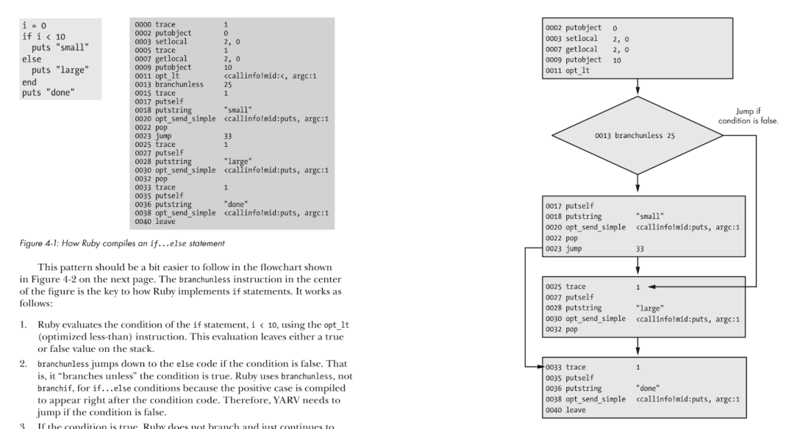
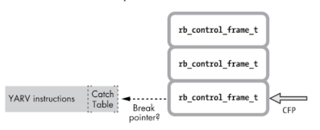
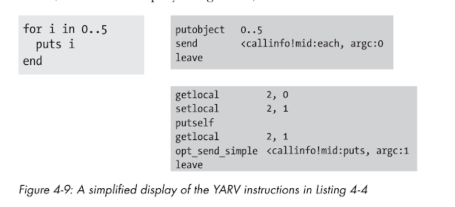

### Chapter 4 - Control Structures and Method Dispatch

YARV handles control with three primary instructions `branchunless`, `branchif` and `jump`

#### Jump/Branchunless


 - Ruby gets to 11 and evaluations opt_lt, this leaves either true or false on stack
 - branchunless (branch unless true) sees that
   - if stack is false, branches and goes to instruction 25
   - if stack is true, continues to 15, evaluates, ends up on 23 which jumps to 33
 
 
#### Leaving a Scope 

- Ruby is dynamic, you can break in any scope.  
- In the below code, ruby needs to be able to exit the loop and continue with the last ruby command in the parent scope.
- To handle YARV uses `throw`, which acts similarly to the Ruby throw keyword

 

To handle the throw YARV uses the concept of a `catch table` in each scope.  They contain a single pointer to where execution should continue after an exeception.  When ruby runs into the thow it
-Iteratres through all of the `rb_control_frame_t` in the stack
-if it finds a catch table pointer, it resets call stack (CFP pointer) and internal YARV to reflect the next execution point.
 - then resets internal PC and SP pointers as needed
-when you use any other throw, it implements catch table with pointer of given name (rescue gets rescue pointer, etc)
 
Things that leave a scope and use break are: 
 - break (throw 2) 
 - return (throw 1)
 - rescue, ensure, retry, redo, next

#### Loops

Ruby implements for loops using each, which is cool to think about.



```
code = <<END
for i in 0..5
  puts i
end
END
puts RubyVM::InstructionSequence.compile(code).disasm
```
 
#### Send  

Most complex instructions, tells YARV to jump to another method and start executing.
1. YARV. calls send
2. Method lookup (looping through classes/modules that make up receiver)
3. Method dispatch (call method by preparing arguments, pushing new frame onto YARV stack, chaning YARV registers to start executing target)
4. YARV executes target method

#### Method Dispatch

During Dispatch, Ruby categorizes your method into 1 of 11 types.

|Method Type|WHATDOESIT?|
|---|---|
|ISEQ|Instruction Sequence, most common|
|CFUNC|C function, mthods that ruby implements for you|
|ATTRSET|Attribute Set, `attr_writer`|
|IVAR|Instance Variable, `attr_reader`|
|BMETHOD|`define_method` with a proc, ruby handles internally differently|
|ZSUPER|uncommon, set a method to be public or private when it is define differently in a superclass|
|UNDEF|removing method from class or `undef_method`|
|NOTIMPLEMENT|For when ruby runs on a platformthat doesn't support particular OS calls|
|OPTIMIZED|Kernel#send, other optimizations|
|MISSING|When asking for a method object from a module using Kernel#method and it is missing|
|REFINED|refinements|

##### ISEQ: Calling Normal Ruby Methods

- Standard methods are created using the def keyword
- Both the calling code and the target are comprised of yarv instructions
- When you call a standard method, you get a new stack frame of type `rb_control_frame_t` set to type [METHOD] and then it executes

Arguments
- consolidated in a table of local variables and arguments for the method
- Labeled as <Arg> so ruby can determine if it needs additional work to call
 - recall different types are (a, b = 1, *args, c, &d) (standard, optional, splat, post, block)
 - Block: must be converted to a proc
 - Optional: adds default value code to method, when you pass argument, YARV resets PC register to skip the code
 - Splat: converted to an array
 - Standard/Post: nuffin
 - Keyword: Ruby has to to extra work, see below for full steps
  
```
c = <<END
def display_message
  puts "displayed!"
end
display_message
END
RubyVM::InstructionSequence.compile(c).disasm
```

##### CFUNC: Calling built in ruby methods

 - Many build in methods are implement as CFUNC (VM_METHOD_TYPE_CFUNC in source)
 - For example, Integer#times, see numeric.c, String#upcase string.c, Struct#each struct.c
 - when called, creates `rb_control_frame_t` of type [CFUNC]
 
Arguments
 - when called, doesn't need to prepare in same way as ISEQ
 - creates new stack frame and calls the c function 
 
##### IVAR and ATTRSET
 -  defined to speed up code, used so often
 - [VM_METHOD_TYPE_ATTRSET] || [VM_METHOD_TYPE_IVAR]
 - these call c functions directly, vm_getivar or vm_setivar
 - this is possible b/c they should not raise execeptions and are fast
 