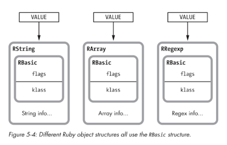
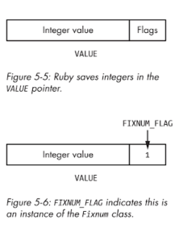

### Chapter 5 - Objects and Classes
 
Every Ruby object is the combination of a class pointer and an array of instance variables

#### RObject

RObject only used to save instance of custom object classes and a few custom object classes.  

 
 
`RObject` c struct holds custom objects and objects
- RBasic
  - klass - What class is this an instance of
  - flags
- numiv - the number of instance variables
- ivptr - pointer to the table that holds instance variables
- st_table - pointer to the has holding the name/id of each ivar and the location of it in the array 
 
```
class Mathematician
  attr_accessor :first_name
  attr_accessor :last_name
end  

# Below the hex string is actually the VALUE pointer for the object 
jim = Mathematician.new
=> #<Mathematician:0x007ff9a9518448>
```

Putting it together with IVars and multiple instances looks like this


#### Generic Objects (int, string, etc)

Every Ruby Value is an object, ruby calls basic data types (integer, string, symbol) "Generic" and handles them differently to optimize performance.

RString, RArray, RRegexp are implemented independently of RObject.  The Generics al share an RBasic information.



With these generic types, ruby goes a step further for optimizations, in cases where it is possible, they use the VALUE pointer to hold the actual value and use the first few bits to hold a flag to represent that it is a real value and not a pointer to a class.



*NOTE:* Since every Object in ruby has ivars, ruby has to hack in order to give these Generic objects IVars.  It keeps a hash called `generic_iv_tbl` and it maintains a map between the generic objects and the pointers to other hashes that contain the IVars


